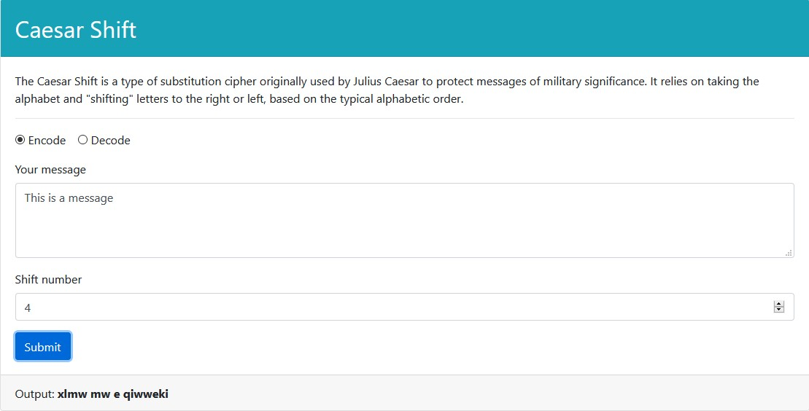
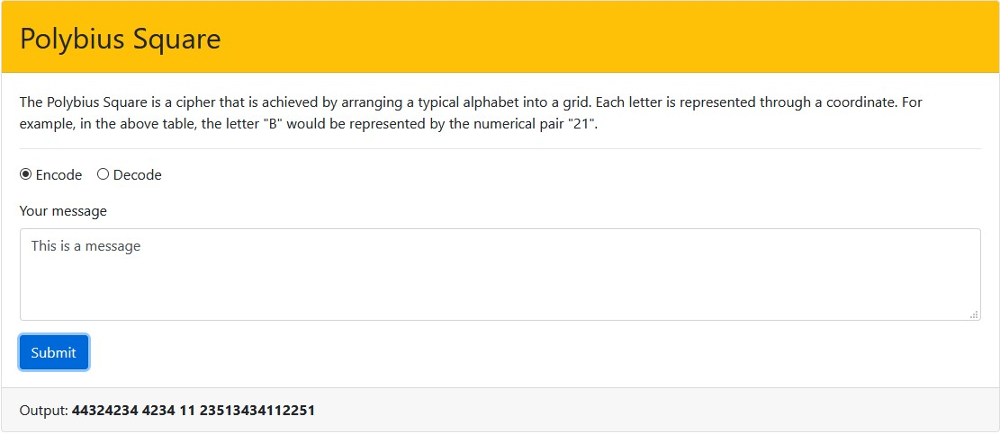
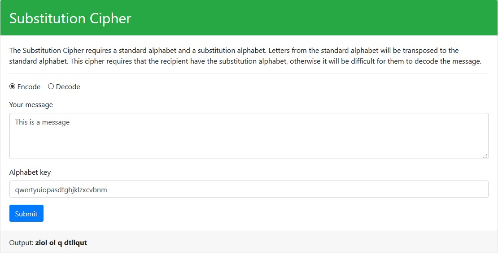

# Module-12-Project-Decoder-Ring

The Decoder Ring project is a web application that allows you to encode and decode messages using a few different methodologies.

## 

## Screenshots

### Ceasar Shift:

### Polybius:

### Substitution:

## Technology

### Built with:
* Javascript
